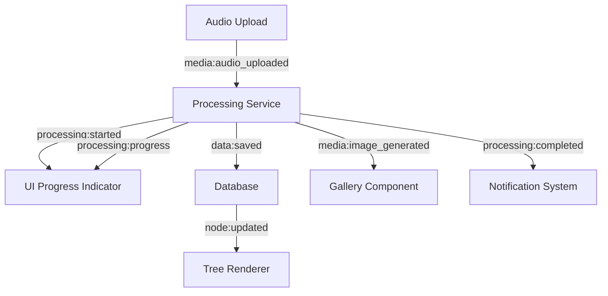

# Branches Conversation Tree - Project Specification

## Executive Summary

The **Branches Conversation Tree** is a multi-faceted platform for visualizing, processing, and analyzing hierarchical conversation data. This specification defines the common framework that enables multiple implementation approaches while maintaining interoperability through standardized data structures, contracts, and message buses.

## Core Concept

The system visualizes conversation recordings as a tree structure similar to git branches, where each node represents an audio recording that can branch into multiple child conversations. The project integrates:

- **Data Storage**: SQLite database with hierarchical conversation structure
- **Visualization**: Web-based UI resembling git branch diagrams  
- **Processing Pipelines**: AI-powered categorization and relationship analysis
- **Media Integration**: Audio recordings with generated images and transcriptions

## Architecture Overview

```
┌─────────────────┐    ┌─────────────────┐    ┌─────────────────┐
│   Data Layer    │    │ Processing      │    │   Presentation  │
│                 │    │ Pipelines       │    │     Layer       │
│ ┌─────────────┐ │    │                 │    │                 │
│ │   SQLite    │ │    │ ┌─────────────┐ │    │ ┌─────────────┐ │
│ │  Database   │◄├────┤ │Categorize & │ │    │ │  Web UI     │ │
│ │             │ │    │ │   Relate    │ │    │ │ (D3.js Tree)│ │
│ └─────────────┘ │    │ └─────────────┘ │    │ └─────────────┘ │
│                 │    │                 │    │                 │
│ ┌─────────────┐ │    │ ┌─────────────┐ │    │ ┌─────────────┐ │
│ │Audio Files  │ │    │ │Image Gen    │ │    │ │Graph View   │ │
│ └─────────────┘ │    │ │Pipeline     │ │    │ │(Git Branches)│ │
│                 │    │ └─────────────┘ │    │ └─────────────┘ │
│ ┌─────────────┐ │    │                 │    │                 │
│ │Generated    │ │    │ ┌─────────────┐ │    │ ┌─────────────┐ │
│ │Images       │ │    │ │Future       │ │    │ │Mobile/      │ │
│ └─────────────┘ │    │ │Pipelines    │ │    │ │Desktop Apps │ │
└─────────────────┘    │ └─────────────┘ │    │ └─────────────┘ │
                       └─────────────────┘    └─────────────────┘
```

## Data Model Specification

### Common Data Structures

These are the fundamental data structures that all implementations must support:

#### Core Entity: ConversationNode

```typescript
interface ConversationNode {
  // Identity
  id: string | number;
  parentId?: string | number;
  parentTime?: number; // seconds into parent recording
  
  // Temporal data
  createdDate: string; // ISO8601
  updatedDate: string; // ISO8601
  duration: number; // seconds
  
  // Content
  audioFilePath: string;
  transcription?: string;
  summary?: string;
  tags?: string[];
  
  // AI-generated content
  prompts?: string[];
  categories?: Category[];
  sentiment?: SentimentAnalysis;
  
  // Hierarchy metadata
  metadata: {
    branchDepth: number;
    siblingOrder: number;
    nodeType: 'root' | 'branch' | 'leaf';
    childCount?: number;
  };
  
  // Relationships (computed)
  children?: ConversationNode[];
  parent?: ConversationNode;
  
  // Media attachments
  images?: GeneratedImage[];
  videos?: GeneratedVideo[];
  
  // Processing state
  processingState?: ProcessingState;
  lastProcessed?: string; // ISO8601
}
```

#### Generated Media Structures

```typescript
interface GeneratedImage {
  id: string;
  nodeId: string;
  filePath: string;
  publicPath?: string; // for web serving
  
  // Generation parameters
  prompt: string;
  negativePrompt?: string;
  style?: string;
  seed?: number;
  model?: string;
  
  // Metadata
  reason?: string; // why this image was generated
  generationTime: number; // seconds
  status: GenerationStatus;
  
  // Technical details
  dimensions?: { width: number; height: number };
  fileSize?: number;
  format?: 'png' | 'jpg' | 'webp';
  
  // Request tracking
  requestPayload?: Record<string, any>;
  createdDate: string; // ISO8601
}

interface GeneratedVideo {
  id: string;
  nodeId: string;
  sourceImageId?: string;
  filePath: string;
  
  // Generation parameters
  movementPrompt: string;
  duration: number;
  fps: number;
  
  // Processing metadata
  status: GenerationStatus;
  generationTime: number;
  createdDate: string;
}

enum GenerationStatus {
  PENDING = 'pending',
  PROCESSING = 'processing',
  COMPLETED = 'completed',
  FAILED = 'failed',
  CANCELLED = 'cancelled'
}
```

#### Analysis Structures

```typescript
interface Category {
  id: string;
  name: string;
  confidence: number; // 0.0 to 1.0
  description?: string;
  textRanges?: TextRange[];
  color?: string; // for UI visualization
}

interface TextRange {
  start: number; // character index
  end: number;
  text: string;
  confidence?: number;
}

interface SentimentAnalysis {
  overall: SentimentScore;
  aspects?: AspectSentiment[];
  emotions?: EmotionScore[];
  confidence: number;
}

interface SentimentScore {
  label: 'positive' | 'negative' | 'neutral';
  score: number; // -1.0 to 1.0
}

interface AspectSentiment {
  aspect: string;
  sentiment: SentimentScore;
  textRanges: TextRange[];
}

interface EmotionScore {
  emotion: 'joy' | 'sadness' | 'anger' | 'fear' | 'surprise' | 'disgust';
  intensity: number; // 0.0 to 1.0
}
```

#### Relationship Structures

```typescript
interface NodeRelationship {
  id: string;
  sourceNodeId: string;
  targetNodeId: string;
  type: RelationshipType;
  strength: number; // 0.0 to 1.0
  explanation?: string;
  createdDate: string;
  metadata?: Record<string, any>;
}

enum RelationshipType {
  // Logical relationships
  DEPENDS_ON = 'depends_on',
  LEADS_TO = 'leads_to',
  CONFLICTS_WITH = 'conflicts_with',
  SUPPORTS = 'supports',
  CONTRADICTS = 'contradicts',
  
  // Temporal relationships
  PRECEDES = 'precedes',
  FOLLOWS = 'follows',
  CONCURRENT = 'concurrent',
  
  // Semantic relationships
  SIMILAR_THEME = 'similar_theme',
  OPPOSITE_THEME = 'opposite_theme',
  ELABORATES_ON = 'elaborates_on',
  REFERENCES = 'references'
}
```

#### Processing State Management

```typescript
interface ProcessingState {
  overall: ProcessingStatus;
  stages: ProcessingStage[];
  currentStage?: string;
  progress: number; // 0.0 to 1.0
  startedAt: string; // ISO8601
  completedAt?: string; // ISO8601
  error?: ProcessingError;
}

enum ProcessingStatus {
  PENDING = 'pending',
  TRANSCRIBING = 'transcribing',
  ANALYZING = 'analyzing',
  GENERATING_PROMPTS = 'generating_prompts',
  GENERATING_IMAGES = 'generating_images',
  GENERATING_VIDEOS = 'generating_videos',
  COMPLETED = 'completed',
  FAILED = 'failed',
  CANCELLED = 'cancelled'
}

interface ProcessingStage {
  name: string;
  status: ProcessingStatus;
  progress: number;
  startedAt?: string;
  completedAt?: string;
  duration?: number;
  metadata?: Record<string, any>;
}

interface ProcessingError {
  code: string;
  message: string;
  stage?: string;
  recoverable: boolean;
  details?: Record<string, any>;
  timestamp: string;
}
```

#### Tree Structure Utilities

```typescript
interface TreeStructure {
  roots: ConversationNode[];
  nodes: Map<string, ConversationNode>;
  relationships: NodeRelationship[];
  metadata: TreeMetadata;
}

interface TreeMetadata {
  totalNodes: number;
  maxDepth: number;
  averageDepth: number;
  totalDuration: number; // aggregate of all audio durations
  createdDate: string;
  lastUpdated: string;
  statistics: TreeStatistics;
}

interface TreeStatistics {
  nodeTypes: Record<string, number>;
  processingStates: Record<ProcessingStatus, number>;
  branchingFactor: number; // average children per node
  leafRatio: number; // percentage of leaf nodes
}
```

### Database Schema

#### Table: audio_recordings
```sql
CREATE TABLE audio_recordings (
    id INTEGER PRIMARY KEY AUTOINCREMENT,
    audio_file_path TEXT NOT NULL,
    created_date DATETIME DEFAULT CURRENT_TIMESTAMP,
    updated_date DATETIME DEFAULT CURRENT_TIMESTAMP,
    transcription TEXT,
    parent_audio_recording_id INTEGER,
    parent_time REAL, -- seconds into parent recording
    duration REAL, -- duration in seconds
    FOREIGN KEY (parent_audio_recording_id) REFERENCES audio_recordings (id)
);
```

#### Table: recording_image_generations
```sql
CREATE TABLE recording_image_generations (
    id INTEGER PRIMARY KEY AUTOINCREMENT,
    audio_recording_id INTEGER NOT NULL,
    image_file_path TEXT NOT NULL,
    prompt TEXT,
    reason TEXT,
    seed INTEGER,
    created_date DATETIME DEFAULT CURRENT_TIMESTAMP,
    status TEXT DEFAULT 'completed',
    FOREIGN KEY (audio_recording_id) REFERENCES audio_recordings (id)
);
```

## Standard API Contracts

### REST API Endpoints

All endpoints follow RESTful conventions and return JSON responses with consistent error handling.

#### Configuration
```
GET /api/config
Response: ConfigurationObject
```

#### Tree Data
```
GET /api/tree-data
Response: {
  roots: ConversationNode[],
  allNodes: { [id: string]: ConversationNode }
}
```

#### Recordings
```
GET /api/recordings
Response: ConversationNode[]

GET /api/recordings/:id/images
Response: ImageGeneration[]
```

#### Images
```
GET /api/images
Response: ImageWithRecordingInfo[]

GET /images/:filename
Response: Binary image data
```

### Standard Response Format

```json
{
  "success": true|false,
  "data": object|array|null,
  "error": {
    "code": "string",
    "message": "string",
    "details": object|null
  }|null,
  "timestamp": "ISO8601 datetime",
  "version": "string"
}
```

## Processing Pipeline Contracts

### Input/Output Standard

All processing pipelines follow a common contract:

#### Input Format
```json
{
  "text": "string",
  "metadata": {
    "source": "recording_id|file_path|manual",
    "timestamp": "ISO8601 datetime",
    "context": object
  },
  "options": {
    "model": "string",
    "temperature": number,
    "seed": number
  }
}
```

#### Output Format
```json
{
  "categories": [
    {
      "id": "string",
      "name": "string",
      "confidence": number,
      "text_ranges": [
        {
          "start": number,
          "end": number,
          "text": "string"
        }
      ]
    }
  ],
  "relationships": [
    {
      "source_category": "string",
      "target_category": "string",
      "relationship_type": "depends_on|leads_to|conflicts_with|supports",
      "strength": number,
      "explanation": "string"
    }
  ],
  "open_topics": [
    {
      "topic": "string",
      "context": "string",
      "suggested_questions": ["string"]
    }
  ],
  "metadata": {
    "processing_time": number,
    "model_used": "string",
    "confidence_score": number
  }
}
```

## Message Bus Architecture

### Event-Driven Communication

The system uses a standardized event bus for decoupled component communication:

#### Core Message Bus Interface

```typescript
interface MessageBus {
  // Event Publishing
  publish<T extends Event>(event: T): Promise<void>;
  publishLocal<T extends Event>(event: T): void;
  
  // Event Subscription
  subscribe<T extends Event>(
    eventType: string, 
    handler: EventHandler<T>,
    options?: SubscriptionOptions
  ): Subscription;
  
  // Request-Response Pattern
  request<TRequest, TResponse>(
    channel: string,
    request: TRequest,
    timeout?: number
  ): Promise<TResponse>;
  
  // Stream Processing
  stream<T>(channel: string, filters?: EventFilter[]): AsyncIterable<T>;
  
  // Lifecycle
  disconnect(): Promise<void>;
  reconnect(): Promise<void>;
  
  // Health monitoring
  getStatus(): BusStatus;
}

interface EventHandler<T> {
  (event: T): Promise<void> | void;
}

interface Subscription {
  id: string;
  unsubscribe(): void;
  pause(): void;
  resume(): void;
}
```

#### Event Structure
```typescript
interface BaseEvent {
  type: string;
  source: string;
  target?: string;
  timestamp: string; // ISO8601
  payload: unknown;
  correlationId?: string;
  version: string;
  priority?: 'low' | 'normal' | 'high' | 'urgent';
  retryCount?: number;
  ttl?: number; // time to live in ms
}

// Specific event types
interface NodeEvent extends BaseEvent {
  payload: {
    nodeId: string;
    nodeData?: ConversationNode;
    previousState?: any;
    context?: ViewContext;
  };
}

interface ProcessingEvent extends BaseEvent {
  payload: {
    jobId?: string;
    nodeId?: string;
    stage: string;
    progress?: number;
    result?: any;
    error?: ErrorDetails;
  };
}

interface MediaEvent extends BaseEvent {
  payload: {
    mediaType: 'audio' | 'image' | 'video';
    mediaId: string;
    filePath?: string;
    metadata?: MediaMetadata;
  };
}
```

#### Standard Event Types

```typescript
// Node Events - Tree structure changes
const NodeEvents = {
  SELECTED: 'node:selected',
  EXPANDED: 'node:expanded',
  COLLAPSED: 'node:collapsed',
  UPDATED: 'node:updated',
  CREATED: 'node:created',
  DELETED: 'node:deleted',
  MOVED: 'node:moved'
} as const;

// Data Events - Database and state changes
const DataEvents = {
  LOADED: 'data:loaded',
  SAVED: 'data:saved',
  ERROR: 'data:error',
  SYNC_REQUIRED: 'data:sync_required',
  BATCH_UPDATE: 'data:batch_update'
} as const;

// UI Events - User interface interactions
const UIEvents = {
  LAYOUT_CHANGED: 'ui:layout_changed',
  ZOOM_CHANGED: 'ui:zoom_changed',
  VIEW_RESET: 'ui:view_reset',
  THEME_CHANGED: 'ui:theme_changed',
  PANEL_TOGGLED: 'ui:panel_toggled'
} as const;

// Processing Events - Background processing
const ProcessingEvents = {
  STARTED: 'processing:started',
  PROGRESS: 'processing:progress',
  COMPLETED: 'processing:completed',
  FAILED: 'processing:failed',
  CANCELLED: 'processing:cancelled',
  QUEUE_CHANGED: 'processing:queue_changed'
} as const;

// Media Events - Audio, image, video handling
const MediaEvents = {
  AUDIO_UPLOADED: 'media:audio_uploaded',
  AUDIO_PLAYING: 'media:audio_playing',
  AUDIO_PAUSED: 'media:audio_paused',
  AUDIO_STOPPED: 'media:audio_stopped',
  IMAGE_GENERATED: 'media:image_generated',
  IMAGE_LOADED: 'media:image_loaded',
  VIDEO_GENERATED: 'media:video_generated'
} as const;

// System Events - Application lifecycle
const SystemEvents = {
  STARTUP: 'system:startup',
  SHUTDOWN: 'system:shutdown',
  ERROR: 'system:error',
  CONFIG_CHANGED: 'system:config_changed',
  HEALTH_CHECK: 'system:health_check'
} as const;
```

#### Message Bus Implementations

```typescript
// Local Event Bus (in-memory)
class LocalMessageBus implements MessageBus {
  private listeners: Map<string, EventHandler<any>[]> = new Map();
  private middleware: Middleware[] = [];
  
  async publish<T extends Event>(event: T): Promise<void> {
    const handlers = this.listeners.get(event.type) || [];
    await Promise.all(handlers.map(handler => handler(event)));
  }
  
  subscribe<T extends Event>(
    eventType: string, 
    handler: EventHandler<T>
  ): Subscription {
    // Implementation details...
  }
}

// WebSocket Message Bus (distributed)
class WebSocketMessageBus implements MessageBus {
  private ws: WebSocket;
  private reconnectAttempts = 0;
  
  constructor(private url: string) {
    this.connect();
  }
  
  private connect() {
    this.ws = new WebSocket(this.url);
    // Connection handling...
  }
  
  async publish<T extends Event>(event: T): Promise<void> {
    if (this.ws.readyState === WebSocket.OPEN) {
      this.ws.send(JSON.stringify(event));
    }
  }
}

// Redis Message Bus (production scaling)
class RedisMessageBus implements MessageBus {
  private redis: RedisClient;
  
  constructor(private config: RedisConfig) {
    this.redis = new RedisClient(config);
  }
  
  async publish<T extends Event>(event: T): Promise<void> {
    await this.redis.publish(event.type, JSON.stringify(event));
  }
}
```

#### Event Flow Patterns



## UI Component Contracts

### Tree Visualization Interface

```typescript
interface TreeRenderer {
  render(data: ConversationNode[]): void;
  updateNode(nodeId: string, data: Partial<ConversationNode>): void;
  expandNode(nodeId: string): void;
  collapseNode(nodeId: string): void;
  selectNode(nodeId: string): void;
  resetView(): void;
  setLayout(layout: 'vertical' | 'horizontal' | 'graph'): void;
  
  // Events
  onNodeClick: EventHandler<NodeClickEvent>;
  onNodeExpand: EventHandler<NodeExpandEvent>;
  onViewChange: EventHandler<ViewChangeEvent>;
}
```

### State Management Interface

```typescript
interface StateManager {
  getState(): ApplicationState;
  setState(state: Partial<ApplicationState>): void;
  subscribe(callback: StateChangeCallback): Unsubscribe;
  
  // Specific state accessors
  getSelectedNode(): ConversationNode | null;
  getCurrentRoot(): string | null;
  getLayoutMode(): LayoutMode;
  getZoomState(): ZoomState;
}
```

## Implementation Guidelines

### Multi-Implementation Strategy

The specification enables different implementation approaches:

1. **Web-First** (Current): React/Vue/Angular frontend with Node.js backend
2. **Desktop Native**: Electron, Tauri, or native desktop applications
3. **Mobile**: React Native, Flutter, or native mobile apps
4. **CLI Tools**: Command-line interfaces for batch processing
5. **Embedded**: Integration into existing applications via iframe/component

### Cross-Platform Data Exchange

#### File Export Format (JSON)
```json
{
  "format": "branches-conversation-tree-v1",
  "exported": "ISO8601 datetime",
  "tree": {
    "nodes": ConversationNode[],
    "relationships": Relationship[],
    "metadata": ExportMetadata
  }
}
```

#### Import/Export API
```
POST /api/export
Body: ExportOptions
Response: ExportedData | FileDownload

POST /api/import
Body: ImportedData
Response: ImportResult
```

## Plugin Architecture

### Plugin Interface

```typescript
interface Plugin {
  name: string;
  version: string;
  description: string;
  
  initialize(context: PluginContext): void;
  execute(input: PluginInput): Promise<PluginOutput>;
  cleanup(): void;
  
  // Event handlers
  onNodeSelected?(event: NodeSelectedEvent): void;
  onDataLoaded?(event: DataLoadedEvent): void;
}
```

### Plugin Types

- **Visualization Plugins**: Custom rendering engines
- **Processing Plugins**: AI/ML analysis pipelines
- **Export Plugins**: Data export to external formats
- **Integration Plugins**: Third-party service connections

## Configuration Management

### Environment Configuration

```json
{
  "database": {
    "path": "string",
    "read_only": boolean,
    "connection_timeout": number
  },
  "media": {
    "audio_directory": "string",
    "image_directory": "string",
    "max_file_size": number
  },
  "ui": {
    "default_root_index": number,
    "initial_expand_level": number,
    "animation_duration": number,
    "node_radius": number,
    "tree_margin": {
      "top": number,
      "right": number,
      "bottom": number,
      "left": number
    }
  },
  "processing": {
    "default_model": "string",
    "temperature": number,
    "seed": number,
    "max_tokens": number
  }
}
```

## Security Considerations

### Data Access Control
- Read-only database access by default
- File system access limited to configured directories
- API rate limiting and input validation
- CORS configuration for web deployments

### Audio/Image Handling
- File type validation
- Size limitations
- Secure file serving with proper headers
- Path traversal prevention

## Performance Standards

### Response Time Targets
- API endpoints: < 200ms for data queries
- Tree rendering: < 500ms for up to 1000 nodes
- Image loading: Progressive loading with placeholders
- Database queries: Indexed for O(log n) performance

### Scalability Guidelines
- Support for 10,000+ conversation nodes
- Efficient memory usage for large trees
- Lazy loading for images and audio
- Pagination for large datasets

## Testing Framework

### Standard Test Categories

1. **Unit Tests**: Individual component validation
2. **Integration Tests**: API and database interaction
3. **UI Tests**: Visual regression and interaction testing
4. **Performance Tests**: Load and stress testing
5. **E2E Tests**: Complete user workflow validation

### Test Data Format

```json
{
  "test_conversations": [
    {
      "id": "test_001",
      "structure": "linear|branching|complex",
      "node_count": number,
      "depth": number,
      "data": ConversationNode[]
    }
  ]
}
```

## Future Extensions

### Planned Features
- **Real-time Collaboration**: Multi-user editing and viewing
- **Version Control**: Tree history and branching
- **Advanced Analytics**: Conversation flow analysis
- **AI Integration**: Smart categorization and insights
- **Mobile Applications**: Native iOS/Android apps

### Extension Points
- Custom visualization engines
- Additional processing pipelines
- External data source connectors
- Advanced export formats
- Webhook integrations

## Implementation Examples

### Minimal Web Implementation

```javascript
// Basic tree renderer
class SimpleTreeRenderer {
  constructor(container, eventBus) {
    this.container = container;
    this.eventBus = eventBus;
  }
  
  render(data) {
    // D3.js tree rendering implementation
    const nodes = d3.hierarchy(data);
    // ... rendering logic
  }
  
  selectNode(nodeId) {
    this.eventBus.emit('node:selected', { nodeId });
  }
}

// State management
class SimpleStateManager {
  constructor() {
    this.state = { selectedNode: null };
    this.listeners = [];
  }
  
  setState(newState) {
    this.state = { ...this.state, ...newState };
    this.listeners.forEach(fn => fn(this.state));
  }
}
```

### CLI Processing Pipeline

```bash
# Standard pipeline execution
./categorize_and_relate.py \
  --input conversation.txt \
  --output results.json \
  --format branches-conversation-tree-v1
```

## Documentation Standards

### API Documentation
- OpenAPI/Swagger specifications
- Interactive documentation with examples
- SDK generation for multiple languages

### Code Documentation  
- JSDoc for JavaScript implementations
- Type definitions for TypeScript
- Inline comments for complex algorithms

### User Documentation
- Getting started guides for each implementation
- Configuration references
- Troubleshooting guides
- Video tutorials for complex features

---

## Conclusion

This specification provides a comprehensive framework for implementing the Branches Conversation Tree system across multiple platforms and use cases. By adhering to these standards, different implementations can:

- Share data seamlessly
- Integrate with each other
- Provide consistent user experiences
- Extend functionality through plugins
- Scale to meet diverse requirements

The modular architecture and standardized contracts ensure that the system can evolve while maintaining backward compatibility and cross-platform interoperability.

---

*Version: 1.0*  
*Date: 2025-08-19*  
*Project: branches-conversation-tree*
